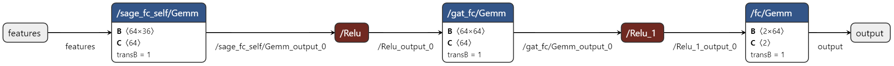

# GRAPHSAGE-ENHANCED-DDOS-DETECTION-WITH-ENTROPY-COMPUTING
A machine learning project focused on detecting Distributed Denial of Service (DDoS) attacks using an enhanced GraphSAGE model combined with Graph Attention Networks (GAT). This approach leverages entropy computing for improved feature selection and anomaly detection in network traffic data.It includes preprocessing, training, and prediction functionalities tailored for identifying and mitigating DDoS attacks.


## Project Overview

The aim of this project is to improve DDoS attack detection using advanced graph-based techniques. It integrates:
- **GraphSAGE**: Aggregates features from neighboring nodes to improve node embeddings.
- **GAT**: Refines node embeddings using attention mechanisms.
- **Entropy Computing**: Determines the importance of features for better detection accuracy.
 

## Installation

To set up the project on your local machine, follow these steps:

1. Clone the Repository:
    ```bash
   git clone https://github.com/Navyaraman/GRAPHSAGE-ENHANCED-DDOS-DETECTION-WITH-ENTROPY-COMPUTING
   cd repository
   ```

2. Set Up a Virtual Environment:
     ```bash
    python -m venv venv
    source venv/bin/activate  # On Windows use `venv\Scripts\activate`
    ```

3. Install Required Packages:
    ```bash
    pip install -r requirements.txt
    ```


Get the Dataset

This project uses the [UNSW-NB15 Dataset](https://research.unsw.edu.au/projects/unsw-nb15-dataset). Download the dataset from the provided link and follow the instructions on the website to obtain the data.

## Model Architecture

The model used in this project is a combination of GraphSAGE and GAT techniques:

- **GraphSAGE Layer**: Aggregates features from neighboring nodes.
- **GAT Layer**: Refines node embeddings using attention mechanisms.
- **Output Layer**: A fully connected layer for classification.

The architecture is as follows:
- **Input Layer**: Node features with dimensionality `feature_dim`.
- **GraphSAGE Layer**: Aggregates features from neighbors.
- **GAT Layer**: Applies attention mechanisms to refine embeddings.
- **Output Layer**: Fully connected layer with softmax activation for classification.

## Model Architecture Visualization

Below is the visualization of the model architecture:




## Usage

To train model:

1. Preprocess the Dataset and Extract Features
Run the index.py script to preprocess the dataset and perform feature extraction.
    ```bash
    python index.py
    ```

2. Train the Model
After preprocessing, run the trainmodel.py script to train the model.
    ```bash
    python trainmodel.py
    ```

Evaluation:

1. To evaluate the performance of the trained model
    ```bash
    python evaluate.py
    ```

The script will output various metrics including accuracy, precision, recall, F1 score, ROC AUC, and PR AUC. Additionally, it will plot the Precision-Recall curve. These metrics and the curve will help you understand the effectiveness of the model in detecting DDoS attacks and provide insights into its performance across different aspects.


## Real-Time Inference

To perform real-time inference with the trained model:

1. Start the Server:
   ```bash
   python server.py
   ```
2. Run the Client:
   ```bash
   python client.py
   ```


## License
All rights reserved.

Please refer to the LICENSE.txt file for full licensing terms. Contact the author at navyaraman248@gmail.com for permission to use or modify this code.